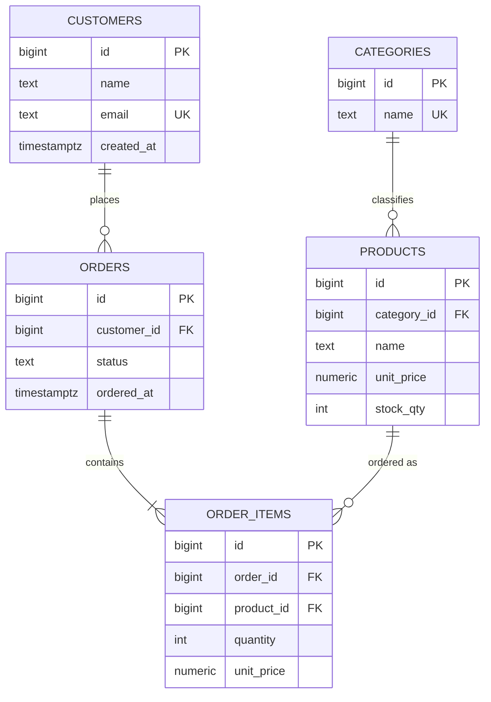
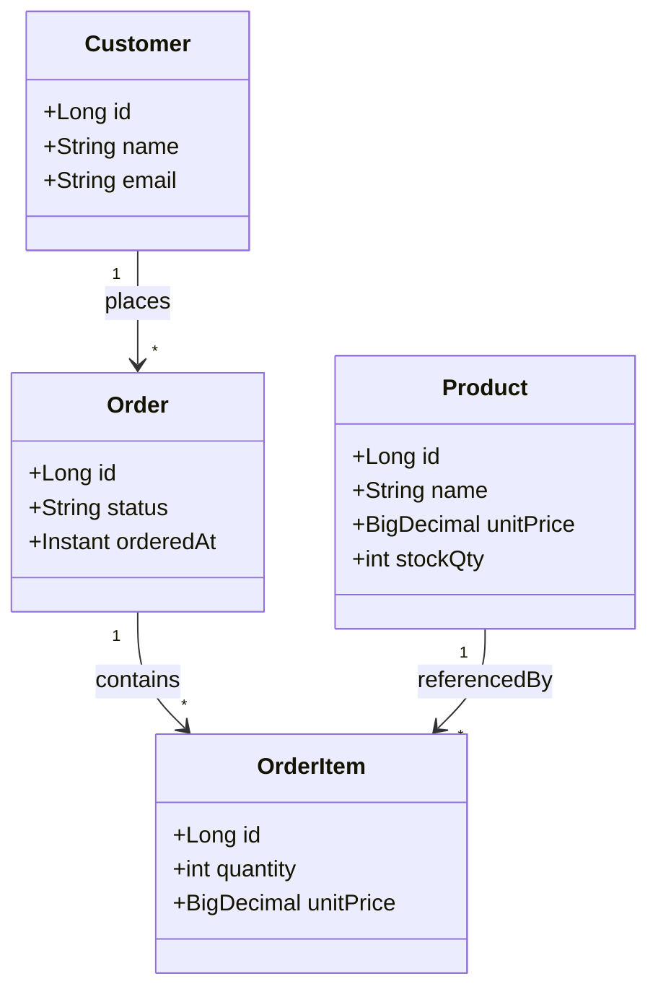

# 02. DDL・ER 図・UML によるテーブル定義

## 目次

- [この章の目標](#この章の目標)
- [なぜ大事か](#なぜ大事か)
- [学習ポイント](#学習ポイント)
  - [1. 制約（DDL の核）](#1-制約ddl-の核)
  - [2. ER 図（Entity-Relationship）](#2-er-図entity-relationship)
  - [3. UML（クラス図）とテーブル](#3-umlクラス図とテーブル)
  - [4. 設定・命名の実務ポイント](#4-設定命名の実務ポイント)
  - [5. サンプルスキーマとの対応](#5-サンプルスキーマとの対応)
- [サンプル](#サンプル)
- [章末課題](#章末課題)
- [次の章](#次の章)

## この章の目標

- `CREATE TABLE` の基本を読める
- PRIMARY KEY / FOREIGN KEY / NOT NULL / UNIQUE / CHECK の意味を説明できる
- ER 図でエンティティとリレーションを表現できる
- UML（クラス図寄り）とテーブル定義の対応を説明できる

## なぜ大事か

SQL の `CREATE TABLE` は最終成果物です。その前に **どんなエンティティがあり、どう関係するか** を図で合意しておくと、手戻りが減ります。ER 図と UML は、そのための共通言語です。

## 学習ポイント

### 1. 制約（DDL の核）

制約は「不正なデータを入れない」ための契約です。アプリ側バリデーションと二重に構えるのが安全です。

| 制約 | 意味 |
|------|------|
| `PRIMARY KEY` | 一意＋NOT NULL |
| `FOREIGN KEY` | 参照先に存在する値だけ許す |
| `NOT NULL` | 必須 |
| `UNIQUE` | 重複禁止（NULL の扱いは方言差に注意） |
| `CHECK` | 値の条件 |

型の目安（PostgreSQL）:

| 用途 | 型例 |
|------|------|
| 整数 ID | `BIGINT GENERATED ALWAYS AS IDENTITY` または `BIGSERIAL` |
| 金額 | `NUMERIC(12, 2)` |
| 文字列 | `TEXT` / `VARCHAR(n)` |
| 日時 | `TIMESTAMPTZ` |

### 2. ER 図（Entity-Relationship）

**ER 図** は、データの「もの（エンティティ）」と「関係（リレーションシップ）」を表す図です。

| 要素 | 意味 | 例 |
|------|------|-----|
| エンティティ | 管理対象の集合 | Customer, Order |
| 属性 | エンティティの性質 | name, email |
| 主キー | 一意に識別する属性 | customer.id |
| リレーション | エンティティ間の関係 | Customer は Order を持つ |
| カーディナリティ | 1対1 / 1対多 / 多対多 | 1人の顧客に複数注文 |

`learning_shop` の関係（1対多）:

```text
categories 1 ── * products
customers  1 ── * orders
orders     1 ── * order_items
products   1 ── * order_items
```

Mermaid による ER 図例:



#### ER からテーブル定義へ落とす手順

1. エンティティごとに表を作る
2. 属性を列にし、主キーを決める
3. 1対多は「多」側に外部キーを置く（例: `orders.customer_id`）
4. 多対多は中間表を作る（例: 注文と商品の `order_items`）
5. NOT NULL / UNIQUE / CHECK で業務ルールを補強する

### 3. UML（クラス図）とテーブル

アプリ設計では **UML クラス図**、DB 設計では **ER 図** がよく使われます。対応の目安:

| UML（ドメイン） | DB |
|-----------------|-----|
| クラス | テーブル（近いが1対1とは限らない） |
| 属性 | 列 |
| 関連・多重度 | 外部キーとカーディナリティ |
| 操作（メソッド） | テーブルには通常持たない（振る舞いはアプリ側） |

Mermaid クラス図（ドメイン寄りの例）:



注意:

- UML のメソッド（振る舞い）は RDB の表には直接載らない（Java オブジェクト側の話。02 章の状態と振る舞いに対応）
- 継承を DB に落とす方法は複数ある（単一表／テーブルごと等）。まずは関連とキーを確実に
- 画面用 DTO と永続化テーブルを無理に一致させない

### 4. 設定・命名の実務ポイント

| 項目 | 推奨の例 |
|------|----------|
| 表名 | 複数形またはチーム規約に統一（`customers`） |
| 主キー | `id`、型は揃える |
| 外部キー | `参照先_id`（`customer_id`） |
| 時刻 | `TIMESTAMPTZ`＋UTC 保管が無難なことが多い |
| 金額 | `NUMERIC`（浮動小数は避ける） |
| 論理削除 | 必要な場合は `deleted_at` 等を設計段階で決める |

### 5. サンプルスキーマとの対応

`samples/shop/00_schema.sql` は、上の ER を DDL に落としたものです。  
図の FK と、SQL の `REFERENCES` が一致しているかを突き合わせて読んでください。

## サンプル

- `samples/shop/00_schema.sql` … 表定義
- `samples/shop/01_seed.sql` … 初期データ

## 章末課題

1. `products` に `unit_price > 0` の CHECK がある理由を説明する
2. 外部キーを外すと、どんな壊れデータが入りうるか例示する
3. 「会員が複数アドレスを持つ」要件を足すとき、ER 図をどう変更するか描く
4. UML クラス図の属性のうち、テーブルに落とすものとアプリだけに残すものを分けて書く

## 次の章

[03. SELECT 基礎](03-select.md)
